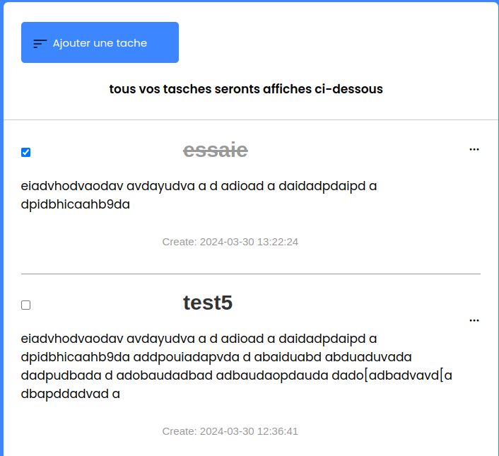

 Ce projet est une application de gestion de tâches simple, développée en utilisant PHP pour la logique côté serveur et MySQL pour la base de données et l'interface en html, css et javascript. L’application permet aux utilisateurs de créer, afficher, mettre à jour et supprimer des tâches.

<h1> Fonctionnalités </h1>
<strong>Ajouter une tâche</strong> : Les utilisateurs peuvent ajouter de nouvelles tâches avec un titre et une description. 
<strong>Afficher les tâches</strong> : La liste des tâches est affichée avec leur statut (en cours ou complétées). 
<strong> Mettre à jour le statut</strong> : Les utilisateurs peuvent cocher une case pour marquer une tâche comme complétée.  
<strong>Supprimer une tâche </strong> : Les tâches peuvent être supprimées de la liste.  

<h1> Installation & Execution </h1>
<strong>Cloner le dépôt</strong> : git clone https://github.com/votre-utilisateur/nom-du-projet.git 
<strong>Configurer la base de données</strong> : Créez une base de données MySQL et importez le fichier SQL fourni (tache.sql).  
<strong>Modifier les informations de connexion</strong> : Dans le fichier <strong>database.php</strong> ce dont le chemin est <strong>/Backend/db</strong>, mettez à jour les informations de connexion à la base de données (hôte, nom d’utilisateur, mot de passe, nom de la base de données). 
<strong>Lancer le serveur</strong> : Utilisez un serveur local (comme XAMPP ou WAMP) pour exécuter l’application. 
<strong>execution<strong> : ecrire cet url sur le navigateur pour lancer le projet <strong>http://localhost/todo%20list%20Hack/</strong>  .

<h1>Structure du Projet</h1>
<strong>index.php</strong> : Page d’accueil affichant la liste des tâches.
<strong>Backend</strong> : contenant toutes les pages lie au interactios avec la base de donnees ainsi nous y trouvons les dossier<strong>function, db et forms </strong>.<brb>
<strong>Frontend</strong> : contenant toutes les pages lie a l'interfacedu projet ainsi nous y trouvons les dossier<strong>css, image et js </strong>. 
<strong>tasks.sql</strong> : Script SQL pour créer la table des tâches.   

<h1> Captures d’écran </h1>

<h1>Auteur</h1>
Ce projet a été développé par:
 <ul>
    <li>NGUEPSSI BRAYANNE</li>
    <li>NOMO GABRIEL</li>
    <li>ADA FRANCINE</li>
    <li>NGO BASSOM ROSALIE</li>
 </ul>